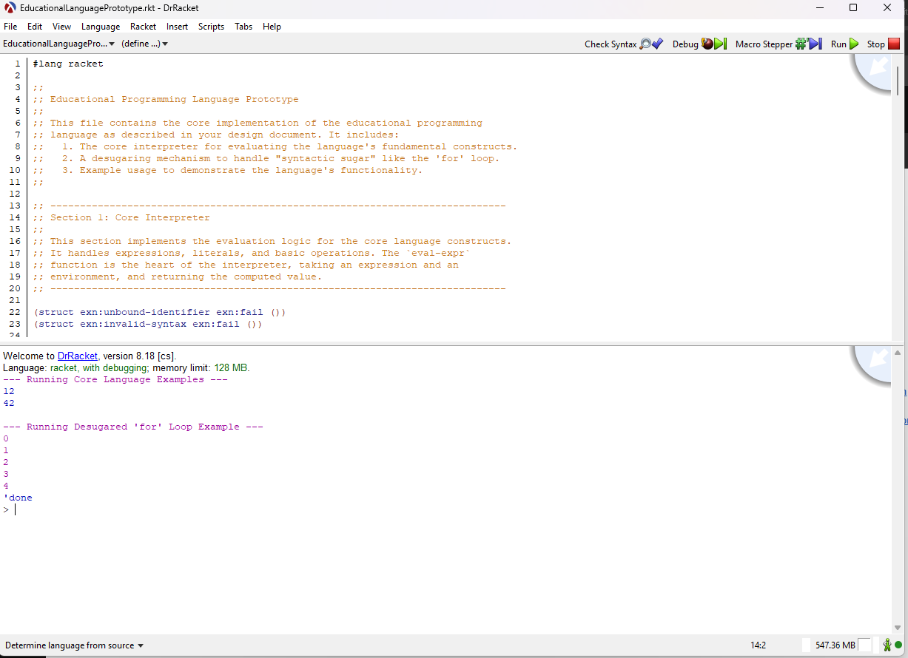

## Educational Programming Language Prototype

This repository contains a prototype implementation of a simple educational programming language, written in Racket. The core language and its interpreter are defined in `EducationalProgrammingLanguage.rkt`.

### Features

- **Core Interpreter**: Evaluates expressions, literals (numbers, strings, booleans), variable definitions, basic arithmetic and comparison operations, conditionals (`if`), and function application using a simple environment model.
- **Variables and Environment**: Supports variable definition (`define`), recursive functions (`letrec`), and proper variable scoping using environments implemented as lists of hash tables.
- **First-Class Functions**: Includes support for defining and calling single-argument lambda functions.
- **Syntactic Sugar via Desugaring**: Implements a desugaring mechanism to expand user-friendly constructs, such as a simple `for` loop, into core language forms before evaluation. The `for` loop is transformed into a recursive function under the hood.
- **Extensible Design**: The interpreter and desugaring logic are designed for easy extension with additional language features or syntactic forms.

### Example Usage

The file includes sample programs demonstrating:

- Variable definition and use in expressions
- Defining and calling lambda functions
- Using the custom `for` loop syntax, which prints a sequence of numbers

### Structure

- **Core Interpreter**: The `eval-expr` function evaluates the core language constructs.
- **Environment Management**: Functions for creating, extending, and manipulating variable environments.
- **Desugaring**: The `desugar` function rewrites syntactic sugar, such as `for`, into core forms.
- **Execution**: The `run-program` function desugars and then evaluates a program in a fresh environment.

### Example

```racket
(run-program '(begin
                (define i 0)
                (for (i 0) (< i 5) (i (+ i 1))
                     (print i))))
```

This example prints the numbers 0 through 4 using the custom `for` loop syntax.

---

### Screenshot

Below is a screenshot of the language running in DrRacket, showing the interpreter code and sample output (including a `for` loop example):



---

This prototype serves as a foundation for building a more feature-rich educational programming language, and is intended for experimentation and learning about interpreters, language design, and Racket programming.